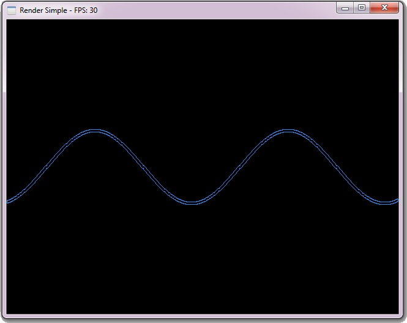
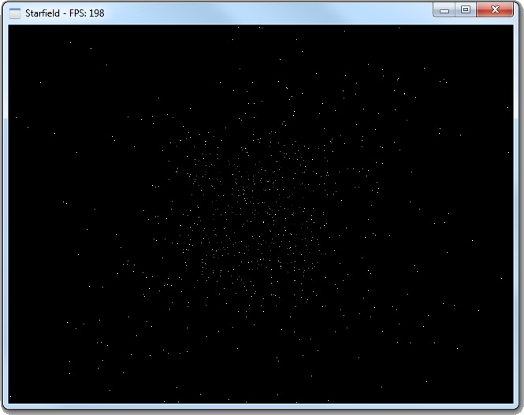
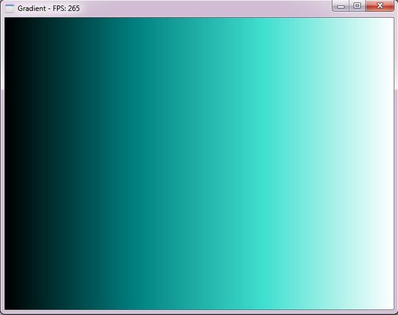
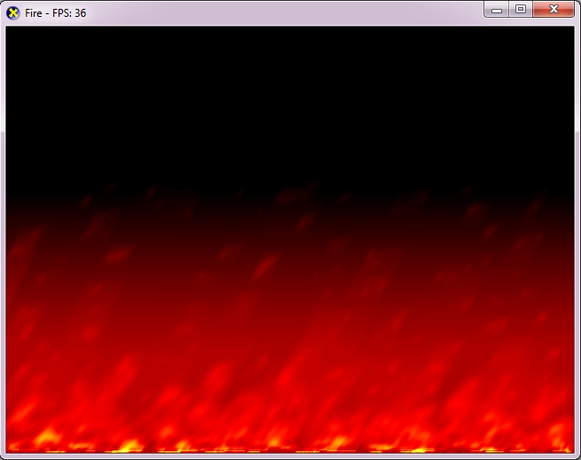

# Plane PresentationFramework

This aim of this project was to write a framework which provides all the common underpinning needed for demonstrating pixel manipulation effects, via GDI or DirectDraw, under a managed context in a Microsoft Windows environment.

Render Simple

Starfield

Gradients 

Fire 

If you have any ideas or feedback, feel free to contact me at bmoretz at IonicSolutions dot net.